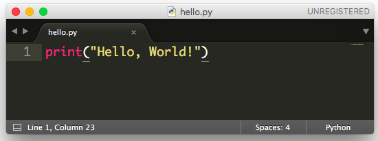
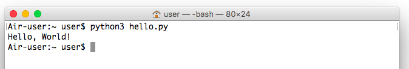
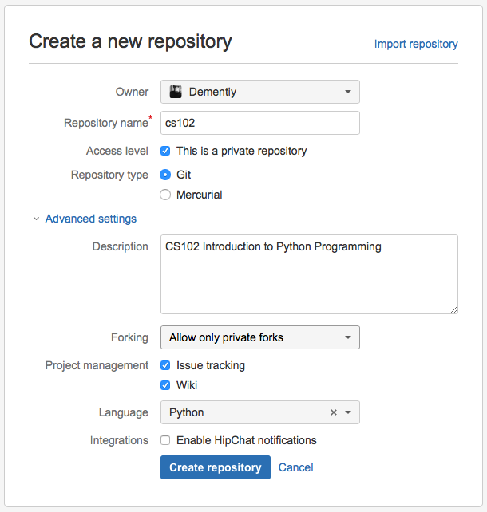
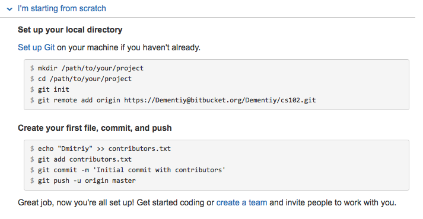
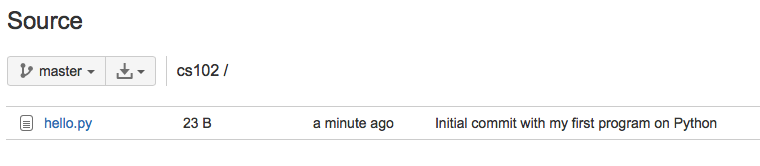

# Настрока рабочего окружения

В этой главе будут описаны все инструменты, которые понадобятся для успешной сдачи этого курса. Раздел будет обновляться, так что следите за изменениями и задавайте вопросы (а также отвечайте на вопросы друг друга), если что-то непонятно.

### Установка интерпреатора Python

Вам будет нужен [интерпретатор](http://stackoverflow.com/questions/2377273/how-does-an-interpreter-compiler-work) языка Python (что такое интерпретатор мы разберем на занятии). Где его взять? На [юникс-подобных](https://ru.wikipedia.org/wiki/UNIX-подобная_операционная_система) операционных системах (Linux, MacOS и др) интерпретатор Python, скорее всего, уже установлен, проверить это вы можете набрав в терминале (командной строке) команду `python`, например:
```sh
$ python
Python 2.7.10 (default, Oct 23 2015, 19:19:21) 
[GCC 4.2.1 Compatible Apple LLVM 7.0.0 (clang-700.0.59.5)] on darwin
Type "help", "copyright", "credits" or "license" for more information.
>>>
```

<div class="alert alert-info">
Знак доллара <tt>$</tt> обозначает приглашение к вводу команд. В Windows такое приглашение обычно выглядит как символ больше <tt>></tt>.
</div>

Обратите внимание на версию, в моем случае это 2.7.10. Нам она не подходит ("*Почему?*" - можно почитать [тут](https://wiki.python.org/moin/Python2orPython3) и [тут](http://sebastianraschka.com/Articles/2014_python_2_3_key_diff.html)). Нам нужен интерпретатор третьей версии. Если вы видите что версия вторая, то попробуйте набрать команду `python3`:
```sh
$ python3
Python 3.6.1 (v3.6.1:69c0db5050, Mar 21 2017, 01:21:04) 
[GCC 4.2.1 (Apple Inc. build 5666) (dot 3)] on darwin
Type "help", "copyright", "credits" or "license" for more information.
>>>
```
Если же появляется сообщение об ошибке, то интерпретор нужно установить. Скачать интерпретор под нужную операционную систему вы можете с официального сайта https://www.python.org/downloads/ (если вы пользователь Linux-системы, то установить интерпретатор можете из репозитория).
После установки обязательно проверьте, что интерпретатор запускается:
```sh
$ python3
>>> print("Hello, World!")
Hello, World!
>>> quit()
```

Это интерактивный режим работы с интерпретатором языка Python ([REPL](https://ru.wikipedia.org/wiki/REPL)). Три символа "больше" `>>>` являются приглашением к вводу команд, чтобы завершить работу с интерпретатором нужно набрать команду `quit()`.

<div class="alert alert-info">
<strong>Важно</strong>: Если вы устанавливаете Python на Windows, то есть вероятность, что, набрав команду <tt>python</tt> или <tt>python3</tt> после установки, вы получите сообщение об ошибке (скорее всего путь к интерпретатору не указан в переменной окружения <tt>PATH</tt>). Пожалуйста, прежде чем задавать вопросы "Почему ничего не работает?", прочитайте как правильно все настроить <a href='https://docs.python.org/3/using/windows.html#configuring-python'>https://docs.python.org/3/using/windows.html#configuring-python</a>.
</div>

Я рекомендую установить модуль [bpython](http://www.bpython-interpreter.org). Это тоже интерпретатор Python, но с дополнительными функциями (подсветка синтаксиса, подсказки и др):
```sh
$ pip3 install bpython
$ python3 -m bpython
```
<div class="alert alert-info">
В этом примере мы использовали <a href="https://docs.python.org/3.5/installing/index.html"><tt>pip</tt></a> для установки нового модуля. Иногда устанавливаемый модуль требует других модулей для своей работы, тогда дополнительные модули устанавливаются автоматически (говорят "по зависимостям"). Но может возникнуть ситуация, когда вам придется вручную установить нужную библиотеку. Если вы не знаете как это сделать, то поищите ответ на <a href="http://stackoverflow.com">stackoverflow.com</a>, скорее всего кто-то уже столкнулся с той же проблемой, что и вы.
</div>

### Выбор редактора кода

Вам будет нужен редактор кода. Это может быть простой текстовый редактор с подсветкой синтаксиса (http://sublimetext.com/3) или же полноценная среда разработки (https://www.jetbrains.com/pycharm/download/). Я вам рекомендую использовать оба варианата (средой разработки пользоваться только после того, как научитесь работать с интерпретатором и системой контроля версий, что будет обязательным для нашего курса).

Для ваших работ заведите себе отдельную папку, назовите ее `cs102` (можете назвать иначе). В этой папке создайте новый файл, откройте его с помощью редактора `SublimeText` (или любого [другого](https://wiki.python.org/moin/PythonEditors), который вам больше понравился) с именем `hello.py`:



Откройте терминал (командную строку), перейдите в папку с созданным файлом (рекомендую вам создать `alias`, т.е. короткое имя для пути, чтобы в будущем вы всегда могли быстро перейти в эту папку):



Таким образом, мы написали и запустили простейшую программу (скрипт). Запомните эти шаги.

### Работа с виртуальными окружениями

Для выполнения работ рекомендуется использовать модуль `virtualenv`, предназначенный для создания и управления изолированными (виртуальными) окружениями. `virtualenv` позволяет заключить в отдельный каталог необходимые версии python-пакетов и использовать только их. Используя `virtualenv`, вы можете устанавливать свежие версии пакетов из [Python Package Index](https://pypi.python.org/pypi), при этом не получить проблем с несовместимостью версий пакетов с установленными в системе.

```bash
$ pip install virtualenv
```

Для более комфортной работы с `virtualenv` мы будем использовать расширение `virtualenvwrapper` (ниже приведены команды для Unix-like систем, см. замечание):

```bash
$ pip install virtualenvwrapper
$ echo "source virtualenvwrapper.sh" >> ~/.bashrc
$ source ~/.bashrc
```

<div class="alert alert-info">
<b>Замечание</b>: Для пользователей Windows следует установить модуль <tt>virtualenvwrapper-win</tt> вместо <tt>virtualenvwrapper</tt>. Также рекомендуется установить <a href="https://git-for-windows.github.io/">Git SCM</a>.
</div>

Создать новое виртуальное окружение можно с помощью команды `mkvirtualenv` (обратите внимание на то, как меняется путь к интерпретатору python):
```bash
$ which python3
/Library/Frameworks/Python.framework/Versions/3.6/bin/python3
$ mkvirtualenv cs102
$ workon cs102
(cs102) $ which python
/Users/dementiy/.virtualenvs/cs102/bin/python
(cs102) $ deactivate
$  
```

Теперь каждый раз приступая к работе активируйте созданное виртуальное окружение с помощью команды `workon cs102`. Полный список команд по работе с `virtualenvwrapper` можно найти [тут](https://virtualenvwrapper.readthedocs.io/en/latest/command_ref.html).

### Система контроля версий

Мы будем пользоваться системой контроля версий (на занятии разберем зачем это нужно, но можете начать читать вот [это](https://git-scm.com/book/ru/v1/Введение-О-контроле-версий) руководство). Вам нужно зарегистрироваться либо на https://github.com, либо на https://bitbucket.org/. Все изменения, которые будут происходить с вашими работами, могут храниться локально (у вас на компьютере), а могут и удаленно, таким образом, вы всегда сможете продолжить работу над своим проектом. На bitbucket есть возможность создания бесплатного приватного (закрытого) репозитория (хранилища) для вашего проекта. Далее приведен пример с использованием bitbucket (рекомендую проделать эти шаги и на github).

Зарегистрируйтесь на сайте https://bitbucket.org/. По окончанию регистрации вам будет предложено создать новый репозиторий (либо вкладка `Repository -> Crete new repository`). Укажите следующие параметры для вашего проекта (в дальнейшем их можно будет изменить):



Далее раскройте список со словами `I'm starting from scratch`:



Достаточно повторить указанные шаги, но вместо файла с разработчиками, мы сделаем коммит (загрузим изменения на сервер) нашей программы `hello.py`:
```sh
$ git init
Initialized empty Git repository in /Users/user/cs102/.git/
$ git remote add origin https://Dementiy@bitbucket.org/Dementiy/cs102.git
$ git add hello.py 
$ git commit -m 'Initial commit with my first program on Python'

*** Please tell me who you are.

Run

  git config --global user.email "you@example.com"
  git config --global user.name "Your Name"

to set your account`s default identity.
Omit --global to set the identity only in this repository.

fatal: unable to auto-detect email address (got 'user@Air-user.(none)')
$ git config --global user.email "Dementiy@yandex.ru"
$ git config --global user.name "Dmitriy"
$ git commit -m 'Initial commit with my first program on Python'
[master (root-commit) b9c8e00] Initial commit with my first program on Python
 1 file changed, 1 insertion(+)
 create mode 100644 hello.py
$ git push -u origin master
Password for 'https://Dementiy@bitbucket.org': 
Counting objects: 3, done.
Writing objects: 100% (3/3), 258 bytes | 0 bytes/s, done.
Total 3 (delta 0), reused 0 (delta 0)
To https://Dementiy@bitbucket.org/Dementiy/cs102.git
 * [new branch]      master -> master
Branch master set up to track remote branch master from origin.
```

<div class="alert alert-info">
<strong>Важно</strong>: Если после выполнения команды <tt>git init</tt> вы получили сообщение об ошибке о том, что команда <tt>git</tt> не найдена, то скорее всего вы работаете под Windows и <tt>git</tt> нужно <a href="https://git-scm.com/download/win">установить</a>.  Также обратите внимание, что пришлось выполнить простейшую настройку <tt>git</tt> с помощью команды <tt>git config</tt>.
</div>

Теперь проверьте на https://bitbucket.org/, что новый файл появился. Для этого зайдите в раздел `Source`:



Давайте немного изменим нашу программу `hello.py`, добавив в нее функцию (на занятиях мы обязательно поговорим о функциях, но пока функцию можно воспринимать как контейнер со списком действий) и проверку на то, выполняется ли наша программа как скрипт или она используется как модуль (библиотека):

```python
def message():
    print("Hello, World!")

if __name__ == "__main__":
    message()
```

```sh
# Запуск программы как скрипта
$ python3 hello.py
Hello, World!

# Использование программы как модуля
$ python3
>>> import hello
>>> hello.message()
Hello, World!
```

Итак, мы внесли нужные изменения в программу, `git` эти изменения также заметил, проверить это можно с помощью команды `git status`:

```sh
$ git status
On branch master
Your branch is up-to-date with 'origin/master'.
Changes not staged for commit:
  (use "git add <file>..." to update what will be committed)
  (use "git checkout -- <file>..." to discard changes in working directory)

	modified:   hello.py

no changes added to commit (use "git add" and/or "git commit -a")
```
Теперь нам нужно сделать коммит, чтобы зафиксировать изменения в истории проекта:
```sh
$ git add hello.py 
$ git commit -m "Add function message()"
$ git push
```

На первое время нам этого будет достаточно.

<div class="alert alert-info">
Если вы не будете задавать вопросы, то, к сожалению, вам никто не сможет помочь. Piazza является основным средством общения (после лекций и практик), где вы можете задать вопрос, попросить помощи, высказать свои пожелания или недовольства касательно курса. Постарайтесь получить удовольствие от наших занятий. Успехов!
</div>