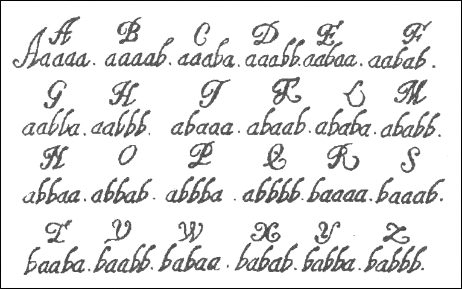

# Лабораторная работа №1

### Шифр Цезаря

[Шифр Цезаря](https://ru.wikipedia.org/wiki/Шифр_Цезаря) является одним из самых простых методов шифрования и заключается в сдвиге всех букв алфавита на три символа вперед:

```
A -> D, B -> E, C -> F, и так далее
```

и, соответственно, три последних буквы алфавита:

```
X -> A, Y -> B, Z -> C
```

Используя шифр Цезаря, слово `PYTHON` будет закодировано следующим образом:

```
PYTHON
||||||
SBWKRQ
```

Ваша задача написать тело для следующих двух функций:

```python
def encrypt_caesar(plaintext):
    """
    >>> encrypt_caesar("PYTHON")
    'SBWKRQ'
    >>> encrypt_caesar("python")
    'sbwkrq'
    >>> encrypt_caesar("")
    ''
    """
    # PUT YOUR CODE HERE
    return ciphertext


def decrypt_caesar(ciphertext):
    """
    >>> decrypt_caesar("SBWKRQ")
    'PYTHON'
    >>> decrypt_caesar("sbwkrq")
    'python'
    >>> decrypt_caesar("")
    ''
    """
    # PUT YOUR CODE HERE
    return plaintext
```

В результате переменные `ciphertext` и `plaintext` должны содержать зашифрованное и расшифрованные сообщения, соответственно.

<div class="alert alert-info">
<strong><a href="https://mail.python.org/pipermail/python-win32/2005-April/003100.html">Подсказка</a></strong>: Воспользуйтесь встроенными функциями <tt>ord()</tt> и <tt>chr()</tt>. Функция <tt>ord()</tt> позволяет получить код для указанного символа, например:<br/>
<tt>
>>> ord('A')<br/>
65<br/>
</tt>
Функция <tt>chr()</tt> работает наоборот - возвращает символ по его коду:<br>
<tt>
>>> chr(65)<br/>
'A'</tt>
</div>

Проверить работу функций можно с помощью примеров, которые приведены в [доктестах](https://docs.python.org/3.5/library/doctest.html) (текст внутри функции, который заключен в тройные кавычки и похож на работу с интерпретатором в интерактивном режиме). Запустить доктесты можно с помощью следующей команды (при условии, что файл с программой называется `caesar.py`):

```sh
$ python3 -m doctest -v caesar.py
```

### Шифр Виженера

[Шифр Виженера](https://ru.wikipedia.org/wiki/Шифр_Виженера) очень похож на шифр Цезаря, за тем исключением, что каждый символ сообщения сдвигается на значение, которое определяется ключом. Ключ это слово, так что каждый символ этого слова указывает на сколько позиций должен быть сдвинут соответствующий символ в шифруемом сообщении, так `A` означает сдвиг соответствующего символа на `0`, `B` на `1` и т.д.

Если длина ключа меньше чем слова, которое подлежит шифрованию, то ключ повторяется необходимое число раз, например:

```
Простой текст:           ATTACKATDAWN
Ключ:                    LEMONLEMONLE
Зашифрованный текст:     LXFOPVEFRNHR
```

Ваша задача написать тело для следующих двух функций так, чтобы переменные `ciphertext` и `plaintext` содержали зашифрованное и расшифрованные сообщения, соответственно.

```python
def encrypt_vigenere(plaintext, keyword):
    """
    >>> encrypt_vigenere("PYTHON", "A")
    'PYTHON'
    >>> encrypt_vigenere("python", "a")
    'python'
    >>> encrypt_vigenere("ATTACKATDAWN", "LEMON")
    'LXFOPVEFRNHR'
    """
    # PUT YOUR CODE HERE
    return ciphertext


def decrypt_vigenere(ciphertext, keyword):
    """
    >>> decrypt_vigenere("PYTHON", "A")
    'PYTHON'
    >>> decrypt_vigenere("python", "a")
    'python'
    >>> decrypt_vigenere("LXFOPVEFRNHR", "LEMON")
    'ATTACKATDAWN'
    """
    # PUT YOUR CODE HERE
    return plaintext
```

<div class="alert alert-info">
Обратите внимание, что символ <tt>A</tt> или <tt>a</tt> в ключе не оказывает никакого влияния на шифруемое сообщение. 
</div>

### Шифр Бэкона

Это задание было представлено на отборочном этапе II Всероссийсокого чемпионата по информационной безопасности Униерситета ИТМО. Далее приведена его формулировка.

Один известный английский ученный и философ 17 века лорд-канцлер Френсис Бэкон предложил идею скрытой передачи информации для её защиты и разработал свой алфавит, изображенный на рисунке:



Используя идею [алфавита Бэкона](https://ru.wikipedia.org/wiki/Шифр_Бэкона), расшифруйте что скрывает за собой фраза:

`наконЕц НаСтуПило Это дОлгОЖдАНное ЛЕТо`

Ваша задача написать тело для следующих двух функций так, чтобы переменные `ciphertext` и `plaintext` содержали зашифрованное и расшифрованные сообщения, соответственно.

```python
def encrypt_bacon(plaintext):
    # PUT YOUR CODE HERE
    return ciphertext

def decrypt_bacon(ciphertext):
    # PUT YOUR CODE HERE
    return plaintext
```

<div class="alert alert-info">
Существует несколько способов шифрования сообщения по методу Бэкона, вы должны самостоятельно определить какой способ подходит для решения этой задачи.
</div>