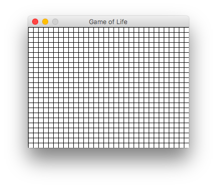
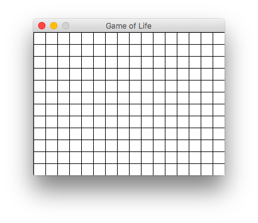
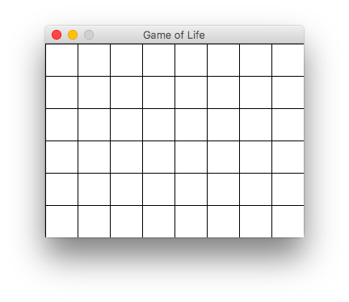

# Лабораторная работа №2. Игра "Жизнь"

В этой лабораторной работе вашей задачей является написать симулятор игры «Жизнь».


Игру «Жизнь» изобрел математик [Джон Хортон Конвей](https://ru.wikipedia.org/wiki/Конвей,_Джон_Хортон) в 1970 году. Она пользовалась популярностью не только среди его коллег. Об увлекательности игры «Жизнь» свидетельствуют результаты множества интересных исследований и многочисленные компьютерные реализации. При этом она имеет непосредственное отношение к перспективной области математики - теории [клеточных автоматов](https://ru.wikipedia.org/wiki/Клеточный_автомат).

Правила игры «Жизнь» достаточно простые:
- «Жизнь» разыгрывается на бесконечном клеточном поле.
- У каждой клетки 8 соседних клеток.
- В каждой клетке может жить существо.
- Существо с двумя или тремя соседями выживает в следующем поколении, иначе погибает от одиночества или перенаселённости.
- В пустой клетке с тремя соседями в следующем поколении рождается существо [1].

Подробнее про игру «Жизнь» можно прочитать в журнале [Квант](http://kvant.mccme.ru/1974/09/igra_zhizn.htm).

Для реализации клеточного поля мы будем использовать набор модулей [pygame](http://pygame.org/hifi.html), предназначенный для создания компьютерных игр.

Для начала нам нужно создать игровое поле, на котором будет разворачиваться действие игры «Жизнь». Поэтому напишем класс `GameOfLife`, который принимает следующие параметры:
- `width` - ширина окна (по умолчанию 640px);
- `height` - высота окна (по умолчанию 480px);
- `cell_size` - высота и ширина клетки (по умолчанию 10px).

Ниже приведен пример создания трех игровых полей одинаковых размеров, но с разным рамзером клеток (10, 20 и 40, соответственно):




Далее представлен листинг, который позволяет создать игровое поле:

```python
import pygame
from pygame.locals import *


class GameOfLife:
    def __init__(self, width = 640, height = 480, cell_size = 10):
        self.width = width
        self.height = height
        self.cell_size = cell_size

        # Устанавливаем размер окна
        self.screen_size = width, height
        # Создание нового окна
        self.screen = pygame.display.set_mode(self.screen_size)
        
        # Вычисляем количество ячеек по вертикали и горизонтали
        self.cell_width = self.width // self.cell_size
        self.cell_height = self.height // self.cell_size
   
   
   def draw_grid(self):
        # http://www.pygame.org/docs/ref/draw.html#pygame.draw.line
        for x in range(0, self.width, self.cell_size):
            pygame.draw.line(self.screen, pygame.Color('black'), 
                (x, 0), (x, self.height))
        for y in range(0, self.height, self.cell_size):
            pygame.draw.line(self.screen, pygame.Color('black'), 
                (0, y), (self.width, y))
   
   
   def run(self):
        pygame.init()
        pygame.display.set_caption('Game of Life')
        self.screen.fill(pygame.Color('white'))
        running = True
        while running:
            for event in pygame.event.get():
                if event.type == QUIT:
                    running = False
            self.draw_grid()
            pygame.display.flip()
        pygame.quit()


if __name__ == '__main__':
    game = GameOfLife(320, 240, 20)
    game.run()
```

<div class="alert alert-info">
Подробное описание всех используемых функций из <code>pygame</code> читайте в официальной <a href="http://www.pygame.org/docs/ref/pygame.html">документации</a>. 
</div>

Каждая клетка может находиться в двух состояниях: "*живая*" или "*мертвая*". Нам нужно создать список (матрицу) клеток размером `cell_height` $$\times$$ `cell_width`, которые в дальнейшем мы будем отображать на нашем поле, окрашивая их в зеленый и белый цвета, для "живых" и "мертвых" клеток соответственно.


```python
def cell_list(self, randomize=False):
    """
    Создание списка клеток.
    
    Клетка считается живой, если ее значение равно 1. 
    В противном случае клетка считается мертвой, то 
    есть ее значение равно 0.
    Если параметр randomize = True, то создается список, где
    каждая клетка может быть равновероятно живой или мертвой.
    """
    pass
```

Теперь нам нужно окрашивать клетки в зеленый или белый цвета в зависимости от того живая клетка или мертвая. Каждая клетка на поле представлена прямоугольником размера `cell_size` $$\times$$ `cell_size`, который можно закрасить с помощью функции `pygame.draw.rect`. Эта функция принимает следующие параметры:

* `Surface` - где нужно отрисовать прямоугольник (в нашем случае это `screen`);
* `color` - цвет, которым следует закрасить прямоугольник (`pygame.Color('white')` или `pygame.Color('green')`);
* `Rect` - координаты прямоугольника в формате `(x, y, длина стороны a, длина стороны b)`.


```python
def draw_cell_list(self, rects):
    """
    Отображение списка клеток 'rects' с закрашиванием их в 
    соответствующе цвета
    """
    pass
```


---
[1] https://life.written.ru - программа для моделирования игры «Жизнь»