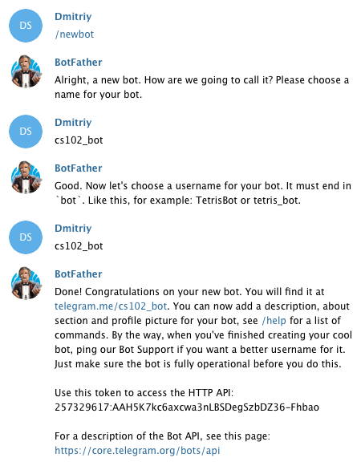

# Лабораторная работа №5. Создание бота для Telegram

Эта лабораторная работа посвящена созданию бота для социальной сети [Telegram](https://telegram.org). Для ее выполнения вам понадобится зарегистрироваться на сайте https://telegram.org (если вы ранее этого не сделали).

<div class="alert alert-info">
<strong>Мотивация:</strong> 18 апреля 2016 года появилась <a href="https://telegram.org/blog/botprize">новость</a>, что выделенен призовой фонд в размере одного миллиона долларов для всех желающих поучаствовать в разработке собственного бота для сети Telegram. Гранты выдаваемые участникам начинаются от 25 тысяч долларов. Конкурс продлится до 18 декабря 2016 года.
</div>

Предварительно мы рассмотрим простой пример создания так называемого эхо-бота. Чтобы зарегистрировать нового бота в телеграмме, вам нужно выполнить несколько простых шагов, которые подробно описаны в этом [руководстве](https://core.telegram.org/bots). Ниже приведен пример регистрации бота с именем `cs102_bot`:



Обратите внимание, что последним ответом `BotFather` был токен доступа (`access_token`), который нам понадобится в дальнейшей работе.

<div class="alert alert-warning">
<strong>Внимание:</strong> У каждого из вас будет свой токен доступа, которым не следует делиться с другими.
</div>

На текущем этапе созданный нами бот ничего не умеет делать и не знает ни одной команды. Для "обучения" бота мы будем использовать [API](https://core.telegram.org/bots/api), который предоставляет телеграмм:

> The Bot API is an HTTP-based interface created for developers keen on building bots for Telegram

Мы не будем напрямую работать с API, как это было в "Лабораторной работе №4", а воспользуемся модулем [pyTelegramBotAPI](https://github.com/eternnoir/pyTelegramBotAPI). Подробное руководство на русском языке по работе с этим модулем вы можете найти [тут](https://kondra007.gitbooks.io/telegram-bot-lessons/content/chapter1.html).

Теперь нам нужно установить модуль pyTelegramBotAPI:

```sh
$ pip3 install pytelegrambotapi
```

Ниже приведен пример простого эхо бота, который дублирует каждое ваше сообщение:

```python
import telebot


access_token = # PUT YOUR ACCESS TOKEN HERE
# Создание бота с указанным токеном доступа
bot = telebot.TeleBot(access_token)


# Бот будет отвечать только на текстовые сообщения
@bot.message_handler(content_types=['text'])
def echo(message):
    bot.send_message(message.chat.id, message.text)


if __name__ == '__main__':
    bot.polling(none_stop=True)
```

Запустить бота можно следующим образом:

```sh
$ python3 bot_api.py
```

Теперь зайдите в телеграмм и напишите вашему боту любое сообщение:


